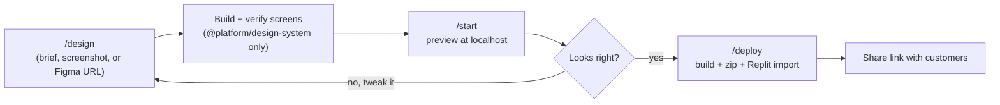

# /setup — Getting Started

Entry point for anyone new to the platform-design-kit. Run this before pointing
the user at `/design`.

## Step 0 — One-time install

All apps (wireframes, templates, block-library) share a single dependency store
at the repo root — there is **no per-wireframe install**. If `node_modules` is
missing at the repo root, run once:

```bash
npm install
```

That's the only install. New wireframes created by `/design` resolve everything
from this shared `node_modules`.

## Step 1 — Check whether the Figma MCP is connected

Call `GetMcpTools` with `{"pattern": "Figma"}` and read `serverStatus` on the
top-level Figma server entry:

- **`"ready"`** → connected. Skip to Step 2.
- **`"needsAuth"` / `"error"` / `"loading"` / missing** → not connected. Give the
  setup instructions below, then continue (the kit works fine from a text brief
  or screenshot without Figma).

### If not connected: setup instructions

Tell the user they don't need Figma to build wireframes from a brief or
screenshot, but connecting it lets `/design` pull frame structure, component
names, and tokens directly from a Figma URL.

**Cursor Desktop (local agent):**
1. Cursor → **Settings** → **MCP & Integrations**.
2. Find **Figma**, click **Connect** / **Authenticate**.
3. Approve the OAuth prompt.
4. Re-run `/setup` (or paste a Figma URL into `/design`) to confirm.

**Cloud Agents (cursor.com/agents):** cloud agents inherit MCP connections from
your Cursor Desktop account — authenticate Figma from Desktop (Settings → MCP &
Integrations → Figma → Connect), and it becomes available to cloud agents.

## Step 2 — List available commands

| Command | What it does |
|---------|--------------|
| `/setup` | Check Figma MCP connection and show this guide. |
| `/design` | Create or extend a wireframe — describe a screen, paste a Figma URL, or attach screenshots. |
| `/start` | Pick a wireframe project and launch its dev server (localhost preview). |
| `/stop` | Stop a wireframe dev server started with `/start`. |
| `/start-blocks` | Launch the block library to browse reusable UI templates. |
| `/stop-blocks` | Stop the block library dev server. |
| `/deploy` | Build a wireframe to static files, zip it, and get Replit import instructions. |

## Step 3 — Show the flow diagram



Narrate it: `/design` builds and verifies a screen, `/start` previews it
locally, iterate until it looks right, then `/deploy` packages it for sharing.
Mention `/start-blocks` as an optional first stop to browse reusable blocks.

## Step 4 — Point them at the next step

> Ready when you are — run `/design` and describe the screen you want, paste a
> Figma URL, or attach a screenshot.

## Notes

- Never attempt to authenticate Figma MCP yourself — it's a one-time human action.
- Re-running `/setup` is safe — it's read-only.
- The design system this kit builds screens from lives in `design-system/` and is
  documented in the [design-system-components](../design-system-components/SKILL.md)
  catalog.
